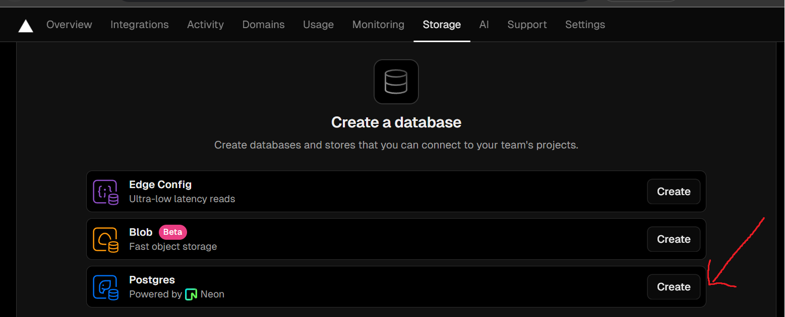
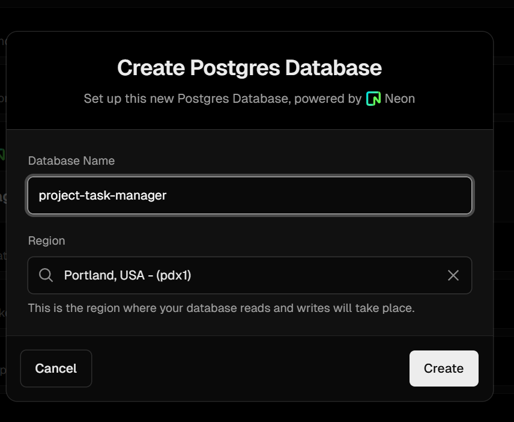
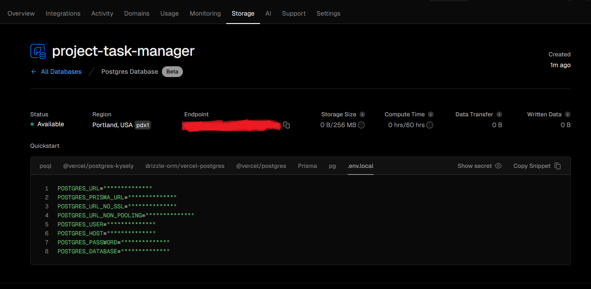
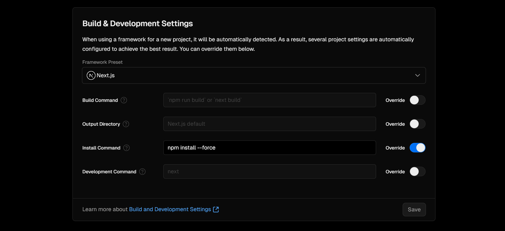
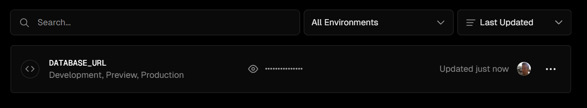

# Next.js 15 Filter List

An interactive, progressively enhanced project task manager with filtering using Next.js 15 with Tailwind CSS and Prisma. It's been purposely slowed down to showcase the handling of loading state.

See `filter-provider` branch for a context API version, which batches all filters into a single state, fixing the problem of them being discarded when toggling across multiple.

See `nuqs` branch for a version using [nuqs](https://nuqs.47ng.com/) to accomplish the same thing. It's probably better to use a library, right?

This is a [Next.js](https://nextjs.org/) project bootstrapped with [`create-next-app`](https://github.com/vercel/next.js/tree/canary/packages/create-next-app).

This project uses [`next/font`](https://nextjs.org/docs/basic-features/font-optimization) to automatically optimize and load Inter, a custom Google Font.

## Getting Started

First, force install the dependencies to make the React 19 Beta work:

```bash
npm install --force
```

## Vercel Storage Postgres Setup

1. Create a postgres database: Home > Storage > Create Database:



2. Name your database:



3. Copy Snippet from the tab **.env.local**



4. Paste this in your .env file.

5. in the .env file rename the **POSTGRES_URL** variable:

```
POSTGRES_URL="postgres://default...
POSTGRES_PRISMA_URL="postgres://default...
```

to **DATABASE_URL**

```
DATABASE_URL="postgres://default...
POSTGRES_PRISMA_URL="postgres://default...
```

## Prisma Setup

Run these scripts:

1. Create the tables with: npm run prisma.migrate

```bash
next15-filterlist$ npm run prisma.migrate

> nextjs-filterlist@0.1.0 prisma.migrate
> npx prisma migrate dev

Environment variables loaded from .env
Prisma schema loaded from prisma/schema.prisma
Datasource "db": PostgreSQL database "verceldb", schema "public" at "...edited..."

Applying migration `20241102184319_migrations_postgresql`

The following migration(s) have been applied:

migrations/
  └─ 20241102184319_migrations_postgresql/
    └─ migration.sql

Your database is now in sync with your schema.

✔ Generated Prisma Client (v5.21.1) to ./node_modules/@prisma/client in 216ms
```

2. Seed prisma/seed.ts for initial data with npm run prisma.seed

```bash
next15-filterlist$ npm run prisma.seed

> nextjs-filterlist@0.1.0 prisma.seed
> npx prisma db seed

Environment variables loaded from .env
Running seed command `ts-node prisma/seed.ts` ...
[SEED] Succussfully create project records
[SEED] Succussfully create teamMember records
[SEED] Succussfully create category records
[SEED] Successfully created task records

🌱  The seed command has been executed.
shogo@miyasato:next15-filterlist$
```

## Dev

Run the development server:

```bash
npm run dev
# or
yarn dev
# or
pnpm dev
```

Open [http://localhost:3000](http://localhost:3000) with your browser to see the result.

## Learn More

To learn more about Next.js, take a look at the following resources:

- [Next.js Documentation](https://nextjs.org/docs) - learn about Next.js features and API.
- [Learn Next.js](https://nextjs.org/learn) - an interactive Next.js tutorial.

You can check out [the Next.js GitHub repository](https://github.com/vercel/next.js/) - your feedback and contributions are welcome!

## Deploy on Vercel

The easiest way to deploy your Next.js app is to use the [Vercel Platform](https://vercel.com/new?utm_medium=default-template&filter=next.js&utm_source=create-next-app&utm_campaign=create-next-app-readme) from the creators of Next.js.

Since we had to do a force install, we need to override the default install with a force also:



Also, you will need to set your environment variable for **DATABASE_URL** in Vercel under **Settings** > **Environment Variables**



Check out our [Next.js deployment documentation](https://nextjs.org/docs/deployment) for more details.
